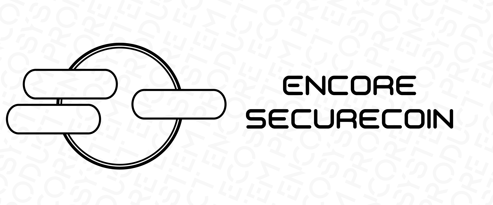

# Encore-Securecoin

[//]: # (The README was prepared using the repository: https://github.com/othneildrew/Best-README-Template)

<br />
<div align="center">
  <a href="https://github.com/kottoamatsukami/Encore-Securecoin">
    
  </a>
  <p align="center">
    A great Telegram Bot for making money on cryptocurrency!
    <br />
    <a href="https://github.com/kottoamatsukami/Encore-Securecoin"><strong>Explore the docs (in progress)»</strong></a>
    <br />
    <br />
    <a href="https://github.com/kottoamatsukami/Encore-Securecoin/issues">Report Bug</a>
    ·
    <a href="https://github.com/kottoamatsukami/Encore-Securecoin/issues">Request Feature</a>
  </p>
</div>


<details>
  <summary>Table of Contents</summary>
  <ol>
    <li>
      <a href="#about-the-project">About The Project</a>
      <ul>
        <li><a href="#built-with">Built With</a></li>
      </ul>
    </li>
    <li>
      <a href="#getting-started">Getting Started</a>
      <ul>
        <li><a href="#prerequisites">Prerequisites</a></li>
        <li><a href="#installation">Installation</a></li>
      </ul>
    </li>
    <li><a href="#usage">Usage</a></li>
    <li><a href="#roadmap">Roadmap</a></li>
    <li><a href="#contributing">Contributing</a></li>
    <li><a href="#license">License</a></li>
    <li><a href="#contact">Contact</a></li>
  </ol>
</details>


<!-- ABOUT THE PROJECT -->
## About The Project

✅This project is a Telegram bot designed to help make money through cryptocurrency trading. The bot can find a profitable trade with a given profit on demand, as well as several other functions, which will be mentioned below. You can configure the bot using .env files (for your bot's token) and config.ini files (to specify your own paths to other files)

<p align="right">(<a href="#readme-top">back to top</a>)</p>


### Built With

Working...

<p align="right">(<a href="#readme-top">back to top</a>)</p>


<!-- GETTING STARTED -->
## Getting Started

Here are the instructions on how to use the bot on your device.

### Prerequisites

Activate the virtual environment of the project (the console is open in the root directory):
* cmd (for Windows)
  ```sh
  venv\Scripts\activate.bat
  ```
* terminal (for Linux and macOS)
  ```sh
  source venv/bin/activate
  ```
### Installation

1. Get a free API Key for telegram bot
2. Create a .env file in the root directory
3. Enter your API key in .env
   ```
   BOT_TOKEN=<put your token here, without quotes (just ctrl+c ctrl+v)>
   ```
<p align="right">(<a href="#readme-top">back to top</a>)</p>


<!-- USAGE EXAMPLES -->
## Usage

Use this space to show useful examples of how a project can be used. Additional screenshots, code examples and demos work well in this space. You may also link to more resources.

_For more examples, please refer to the [Documentation] (https://example.com) **Documentation in progress**_

<p align="right">(<a href="#readme-top">back to top</a>)</p>


<!-- ROADMAP -->
## Roadmap
- [x] Develop an algorithm
- [x] Write project structure
- [x] Create spot arbitrage algorithm
- [ ] Run a bot with limited capabilities
- [ ] Multi-language Support
    - [ ] Russian
    - [ ] English
    - [ ] Spanish
    - [ ] French
    - [ ] other languages...
- [ ] Create p2p arbitrage algorithm
- [ ] Create multi arbitrage algorithm
- [ ] Create "whale trading" algorithm
- [ ] 📈

See the [open issues](https://github.com/kottoamatsukami/Encore-Securecoin/issues) for a full list of proposed features (and known issues).

<p align="right">(<a href="#readme-top">back to top</a>)</p>


<!-- CONTRIBUTING -->
## Contributing

🍪 Contributions are what make the open source community such an amazing place to learn, inspire, and create. Any contributions you make are **greatly appreciated**.

If you have a suggestion that would make this better, please fork the repo and create a pull request. You can also simply open an issue with the tag "enhancement".
Don't forget to give the project a star! Thanks again!

1. Fork the Project
2. Create your Feature Branch (`git checkout -b feature/AmazingFeature`)
3. Commit your Changes (`git commit -m 'Add some AmazingFeature'`)
4. Push to the Branch (`git push origin feature/AmazingFeature`)
5. Open a Pull Request

<p align="right">(<a href="#readme-top">back to top</a>)</p>


<!-- LICENSE -->
## License

⚠ Distributed under the MIT License. See `LICENSE` for more information.

<p align="right">(<a href="#readme-top">back to top</a>)</p>


<!-- CONTACT -->
## Contact

Maksim Shushkevich - [@Kottoamatsukami](https://t.me/Kottoamatsukami) - meshushkevich.work@gmail.com

<p align="right">(<a href="#readme-top">back to top</a>)</p>